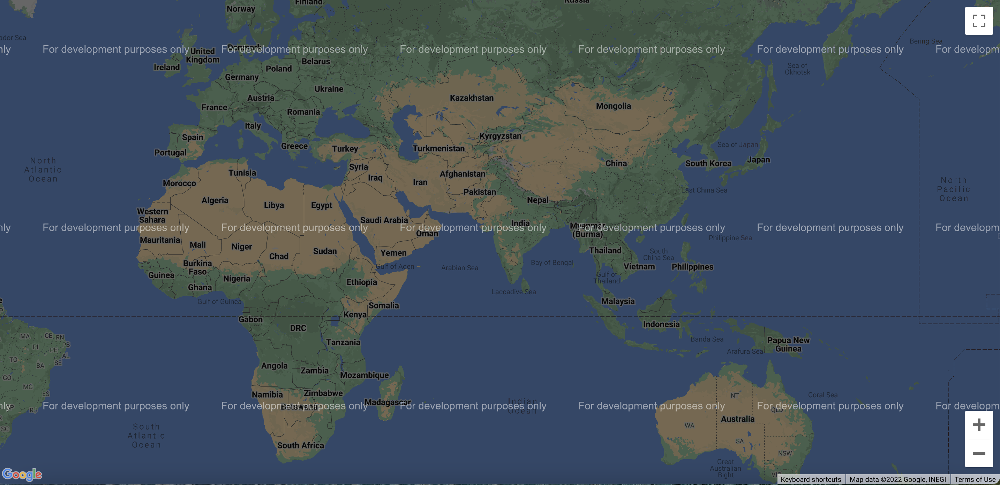
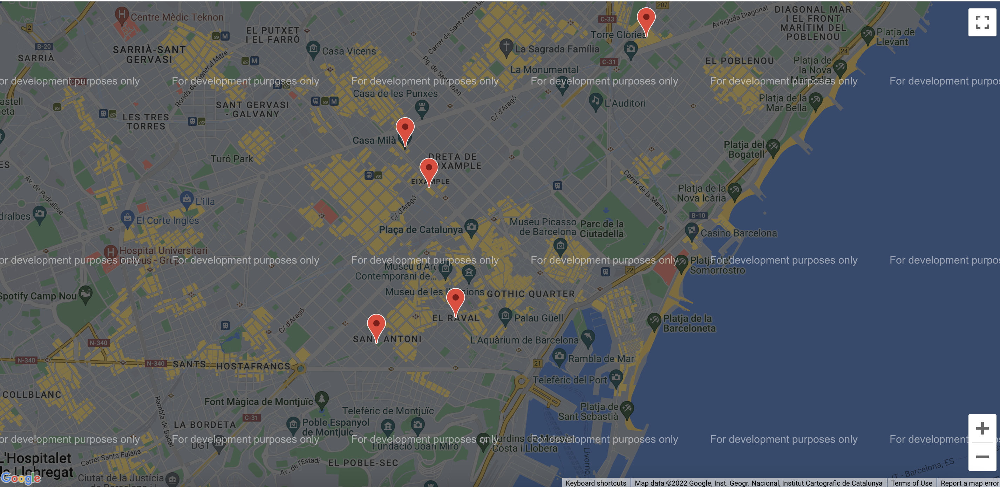
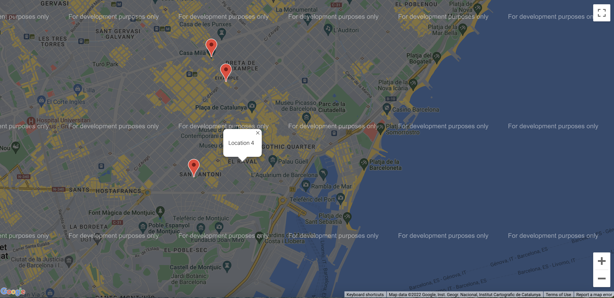
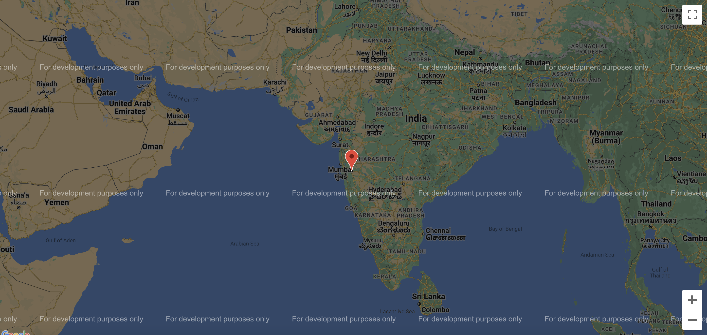
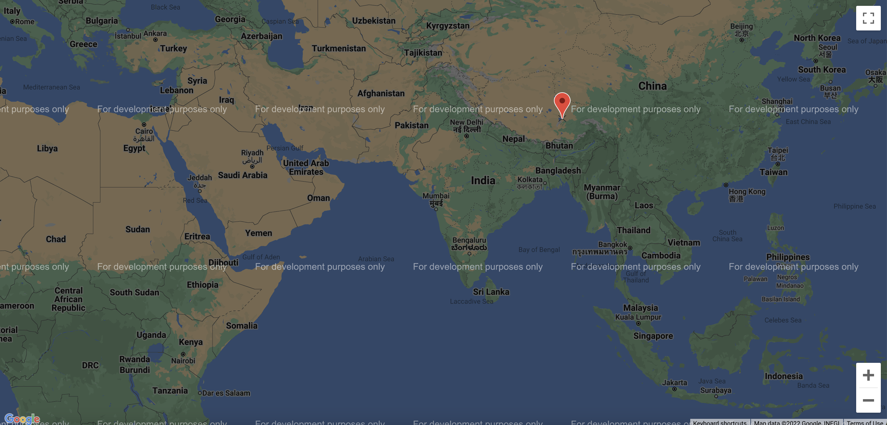

This is React App where we integrate Google Map API 
This project has two branches:
1. Main branch 
    - it shows some predefined locations and their info when we click on the marker which are marking the predefined locations
    
2. currenpos branch
    - this branch take the current location of the user and point it onto the map, also we can drag the marker anywhere on the world map in this branch.
    
    
# Images Reference :

## 1.Rendering Google Map in your React component

## 2.Adding clickable markers in your Google Map

    
## 3.Adding infoWindows

## 4.Dynamically showing marker using Geolocation API

## 5.Draggable marker

